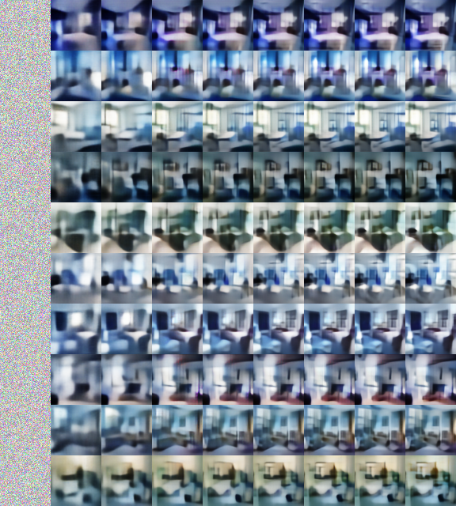

# Implementation of Sequential VAE


This is the implementation of the Sequential VAE. (Cite) identifies a link between power of latent code and sharpness of generated samples. We are able to generate fairly sharp samples by gradually augmenting the power of latent code.

Samples look like this




# Training with Default Configuration

## CelebA

For CelebA download the dataset from http://mmlab.ie.cuhk.edu.hk/projects/CelebA.html

Download the [aligned and cropped version](https://drive.google.com/open?id=0B7EVK8r0v71pbWNEUjJKdDQ3dGc), unzip into a folder, and pass the path of that folder as ```db_path``` argument. Note that your ```db_path``` folder should directly contain all the image files without any additional nesting. You folder should look like this


Now you can train by running

``` python train.py --dataset=celebA --db_path=/path/to/celebA/dataset ```

You can see the visualizations in the folder ```$pwd/models/[network_name]/samples```

# LSUN

For LSUN bedroom we provide a preprocessed version available for download here. The images have been center cropped, resized, and organized into batches with 10000 images each for efficient I/O. 

Download this dataset, unzip into a folder. This folder should also directly contain all the ```npy``` files without additional nesting. You can train by running

``` python train.py --dataset=lsun --db_path=/path/to/lsun/dataset ```

For other LSUN scene classes you should first preprocess the files into batches of 10000, where each batch is a numpy array ```[batch, height, width, channel]```. 

# More Options

- To use a particular GPU/GPUs add option ```--gpus=[ids]``` such as ```--gpus=0,1``` to use GPU 0 and 1. The visualizations in the paper are produced after 2 days of training on a single Titan X.
- To use other architectures other than default, use ```--netname=[name]```. For supported architectures please refer to code. The name is the unique identifier for the network, and all related training log, visualizations, and checkpoint files, etc will be stored in the directory ```$pwd/model/netname```. For example, to run visualization with tensorboard use ``` tensorboard --logdir=[that directory]```.
- To change batch size, add ``` --batch_size=[size]```
- To visualize and plot the autoencoding reconstruction of the model, add ```--plot_reconstruction```
- To add Gaussian and salt and pepper noise to perform denoise training add ```--denoise_train```